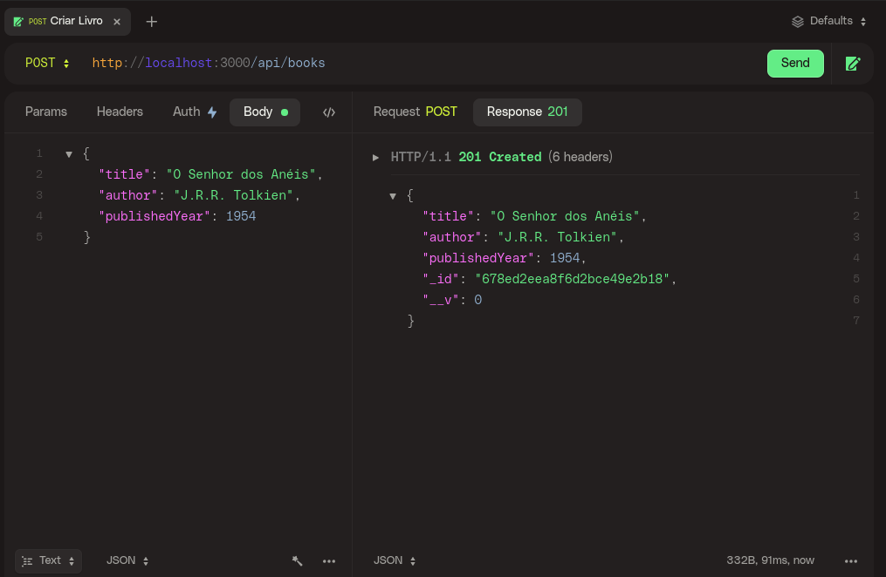
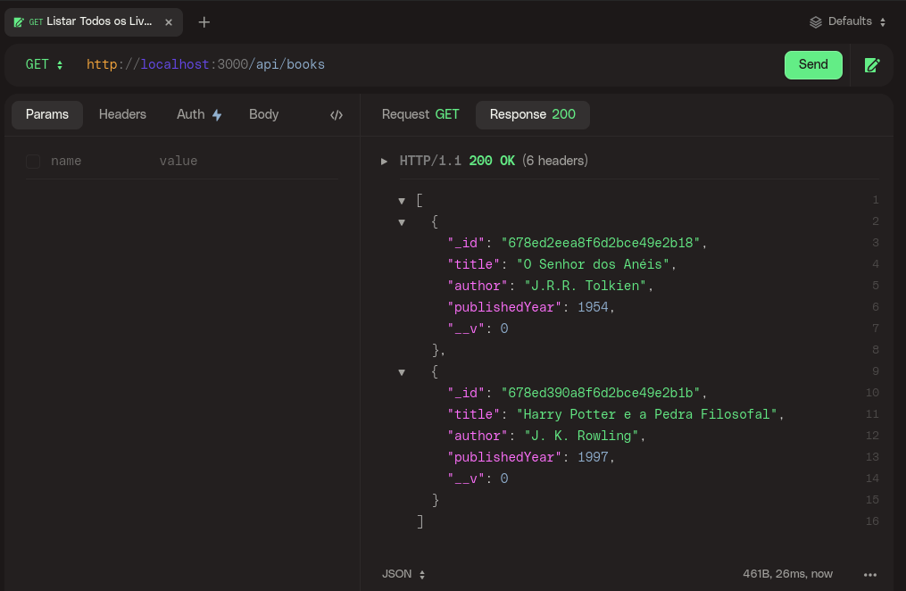
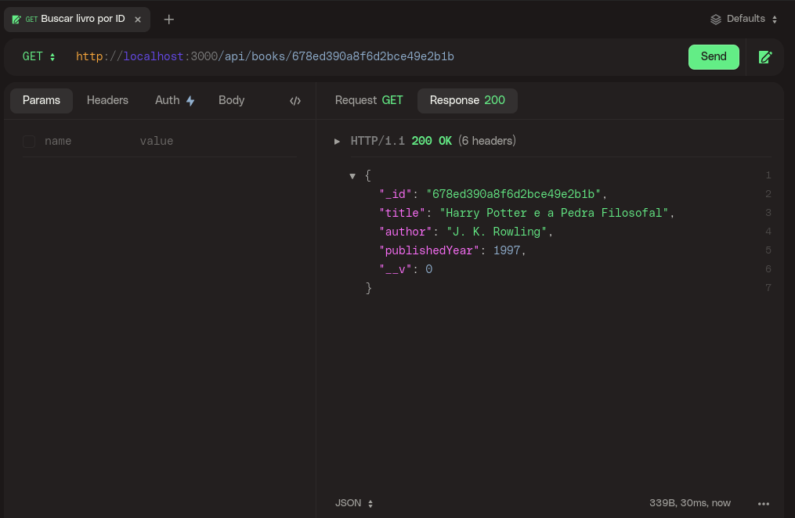
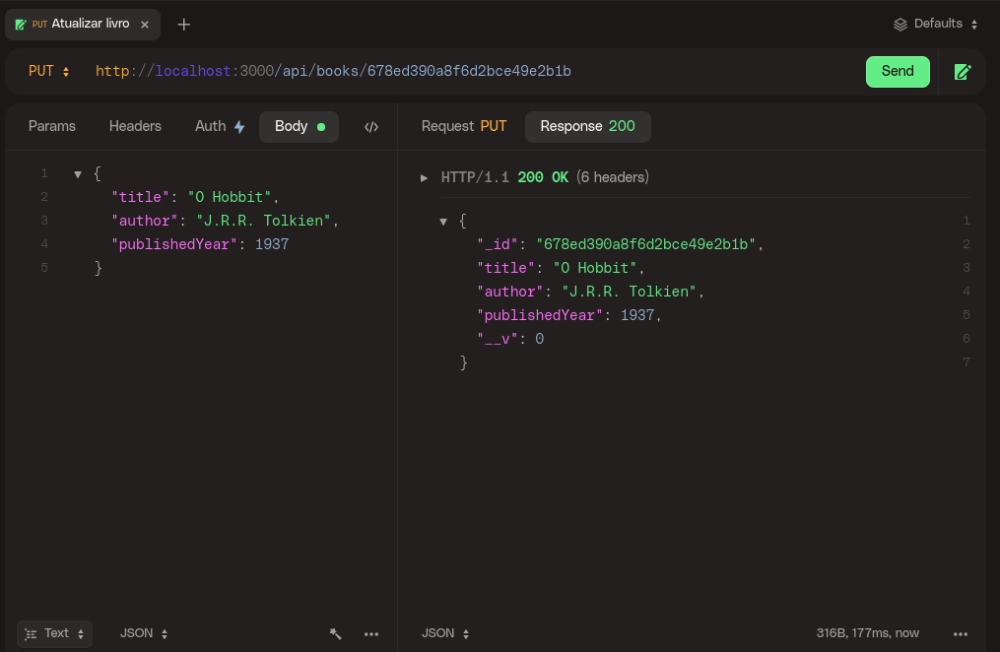
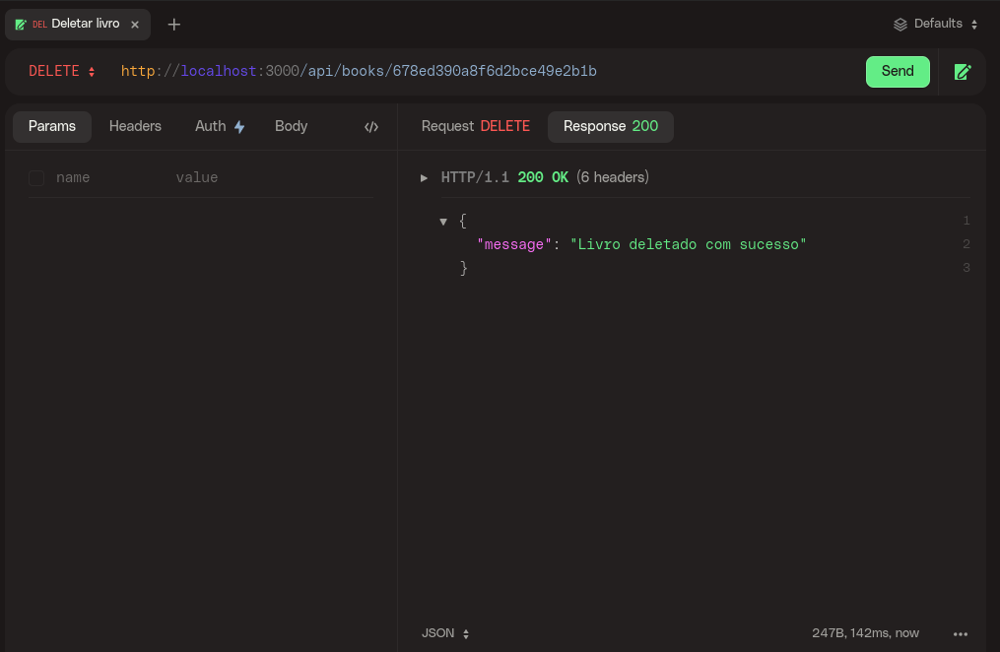

# Repository of my book crud project using Node.js

## Commands used

### Creating the project and installing the necessary dependencies

- `$ npm init -y`
- `$ npm install express mongoose body-parser dotenv`
- `$ npm install --save-dev nodemon`

### Adding the initialization script in package.json:

```json
"scripts": {
  "start": "node src/server.js",
  "dev": "nodemon src/server.js"
}
```

### Uploading project with Docker Compose

- `$ docker-compose up --build`

### Running the docker image

- `$ docker-compose up -d`

## Project images

### Create a book



### List All Books



### Search Book By ID



### Update Book



### Delete Book


